## School Managment System

This is a school managment system with modules as dashboard, students, teachers, classes, course, grades, classrooms, bimesters.
This app is an interface made in Angular and design with Angular Material and Ngx-Charts.

Angular CLI version **13.1.4**

# App images

Main dashboard

Student's grades dashboard
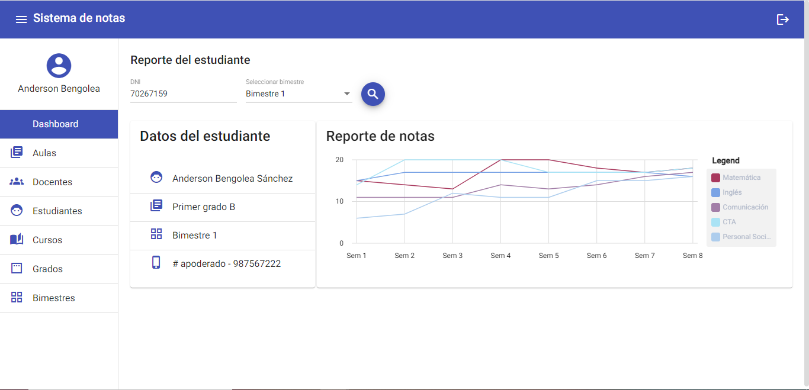

Clasrooms
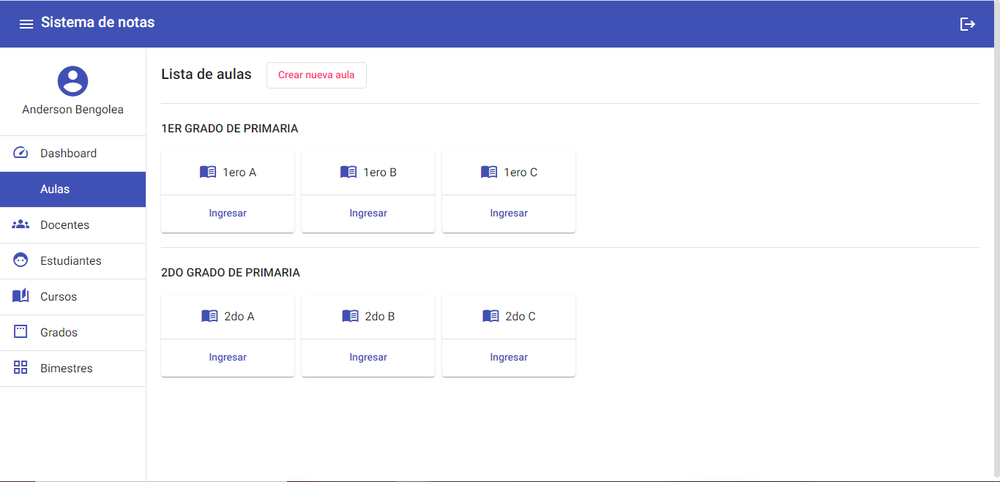

Clasroom form
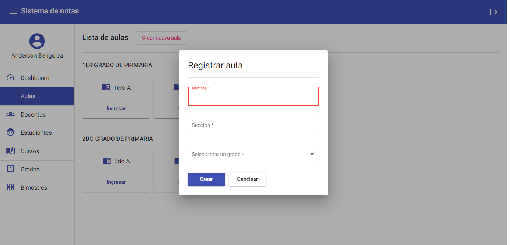

Classes
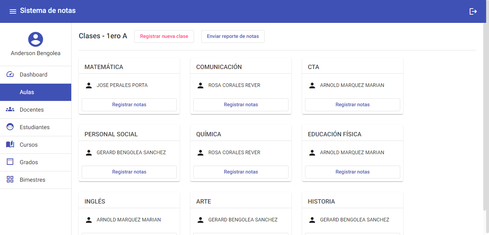

Class form
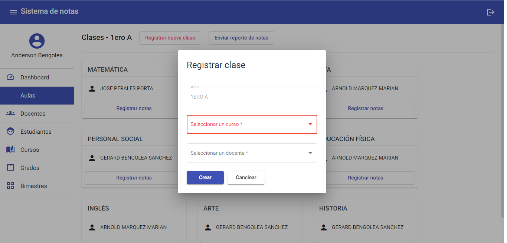

Marks
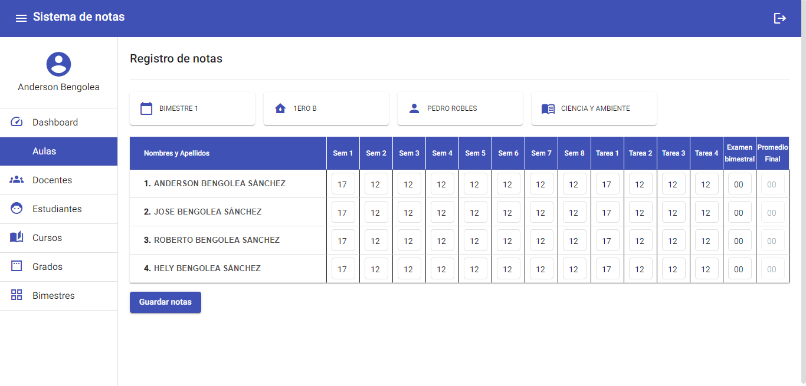

Teachers
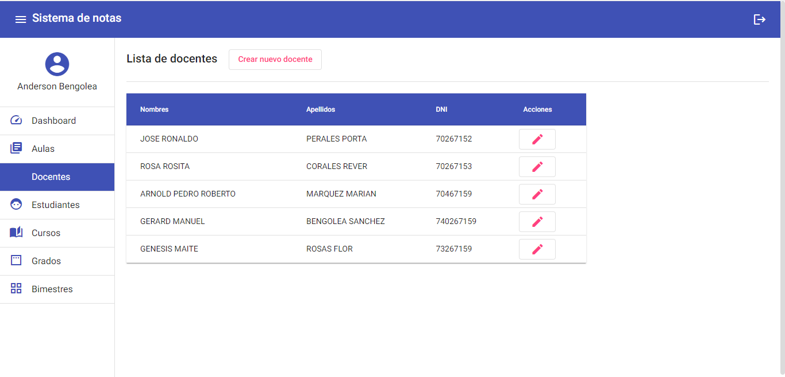

Students
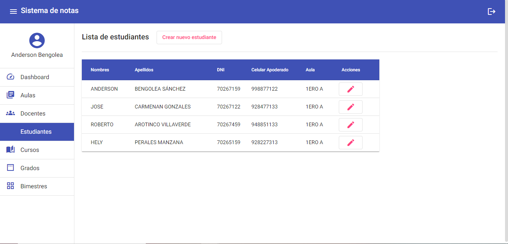

Courses
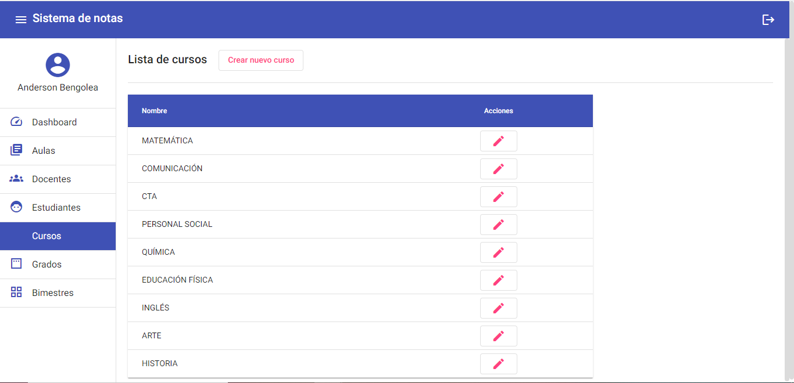

Grades
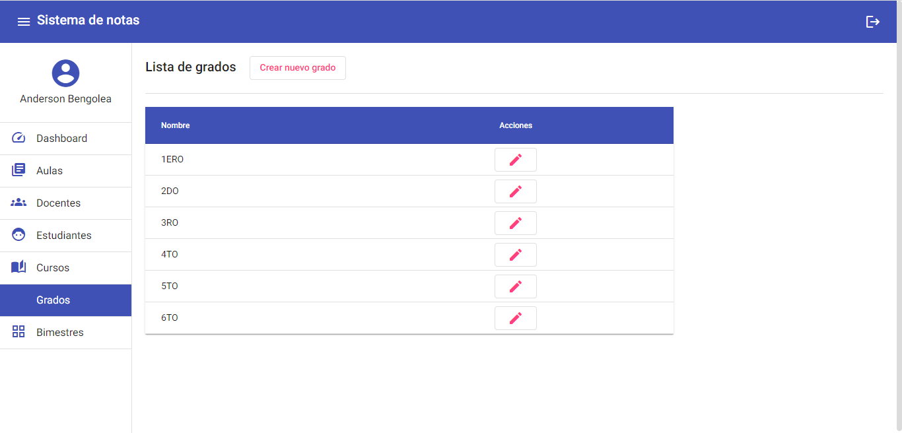

Bimesters
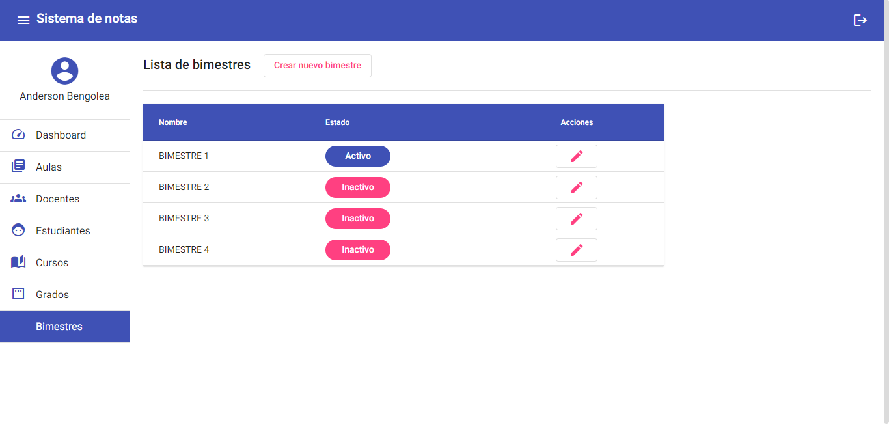

**Installation**

Clone the repository using git.

`git clone https://github.com/Trueander/proyecto-colegio.git`

To start the project with static data, go back to this commit.

`git checkout 6aa98f46ffb110eaf6535cf90dad267bfea936c1`

Open the terminal and install the dependencies.

`npm install`

Run the project.

`ng s -o`

or

`npm start`
